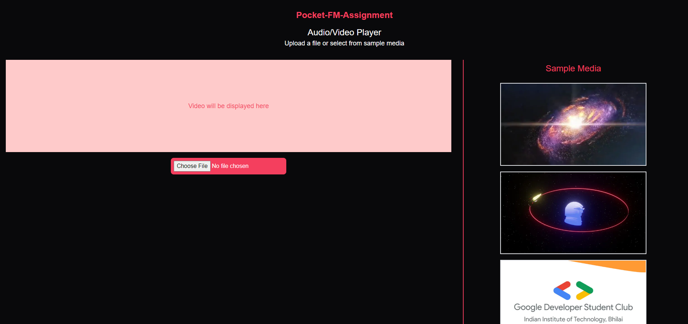
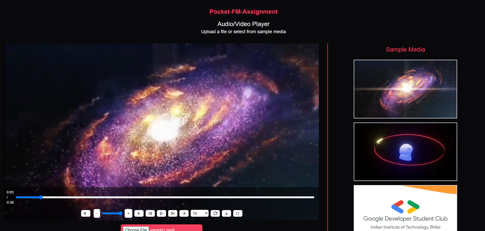
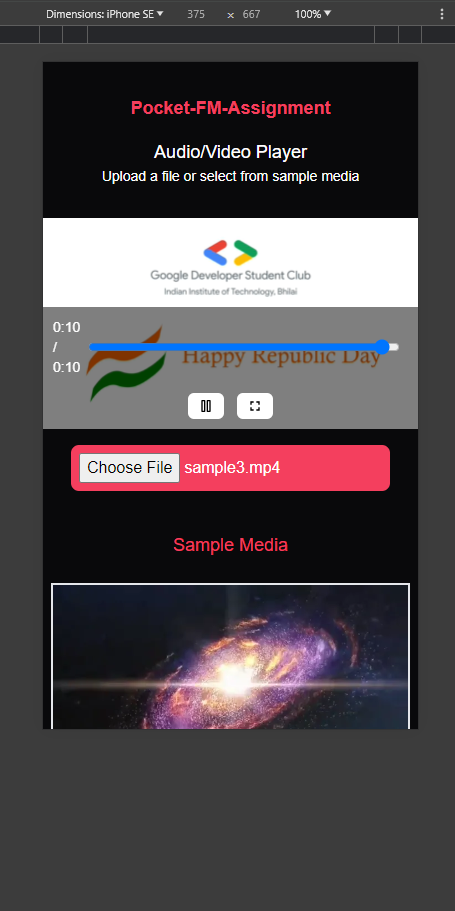
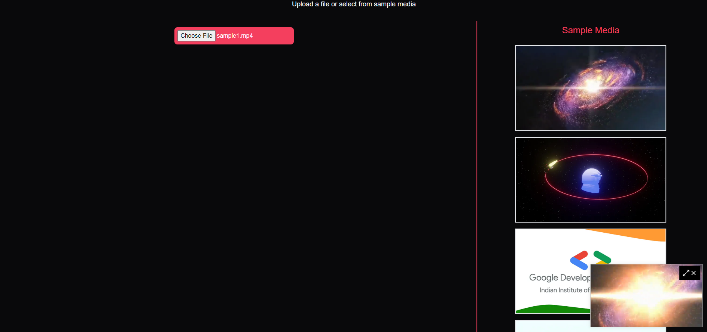

# Audio/Video Player with Custom Controls

This project is an audio/video player with custom controls. The player is capable of distinguishing between audio and video URLs and adapts its functionality accordingly.

## Live at

You can access the live demo of the media player [here](https://media-player-bice-theta.vercel.app/).

## Features

- Play/Pause (Spacebar)
- Previous (P)
- Next (N)
- Up/Down Arrow: Volume Control and M for mute
- Minimize (W)
- Full Screen (F)
- Right/Left Arrow: 10-second Forward/Backward
- Play Speed Control (0.5x to 4x) on 0.25 interval Can use "{" and "}" keys
- Progress Bar indicating media progress
- Automatically hide controls unless hovered over or the player is paused

## Custom Hooks

The project utilizes two custom hooks:

1. `useMediaControls`: This hook provides the functionality for the media controls such as play, pause, volume control, mute, playback rate control, and seek.

2. `QueueContext`: This hook provides the functionality for managing the queue of media files.

## Getting Started

- npm i
- npm run dev

## Screenshots

*You can either select from sample videos or choose local file*

*Playing local file*

*Responsive + When playing from sample, it adds remaining media to queue*

*Expand and close feature in minimized window*